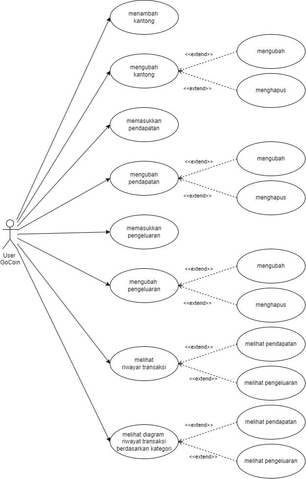
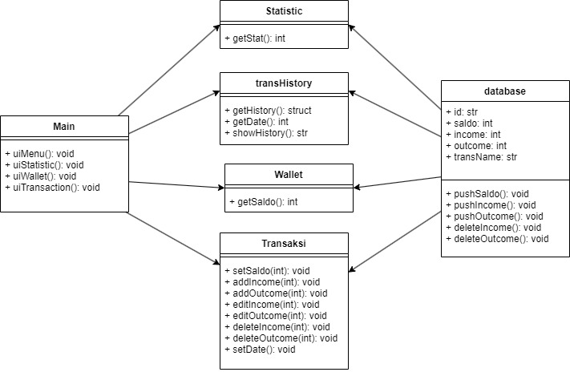
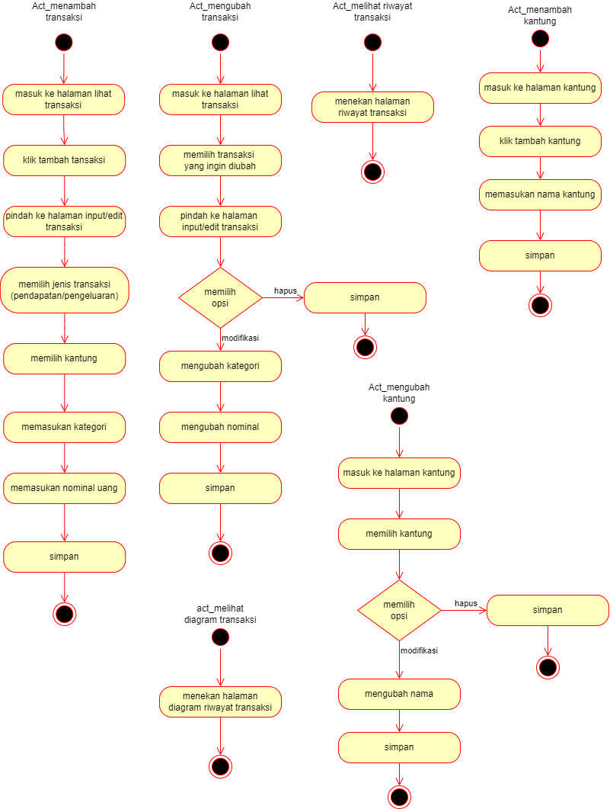
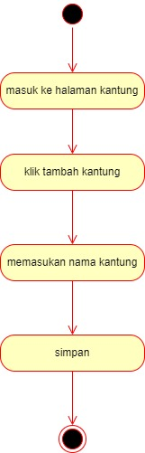
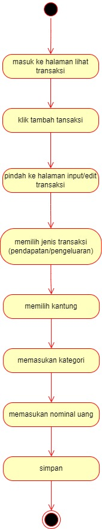
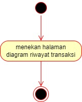
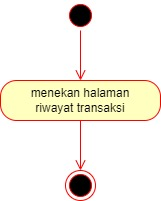
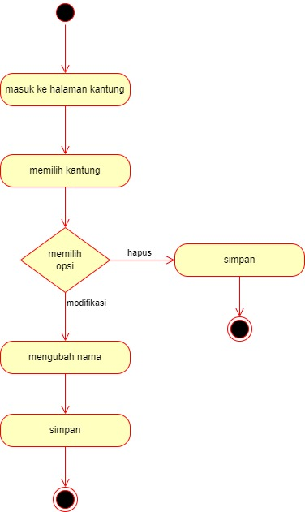
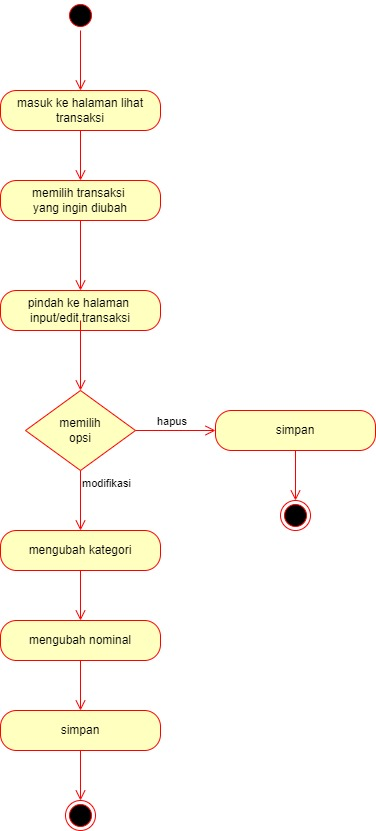
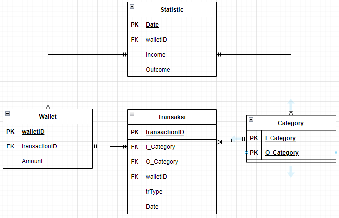

# GoCoin
GoCoin merupakan sebuah aplikasi berbasis windows form yang berfungsi untuk mengatasi masalah manajemen kuangan baik untuk individu maupun organisasi. 
Solusi yang diusulkan GoCoin berserta fitur-fiturnya sebagai berikut: 
- tracking pemasukan dan pengeluaran 
- manajemen uang berdasar pocket atau kantung 
- tampilan diagram pengeluaran

## Kelompok 8
- Ketua Kelompok	: Muchammad Hasan Chamdany - 20/456846/TK/50670
	- Anggota 1		: Muhammad Arif Hidayat - 20/463609/TK/51601

## Rancangan Aplikasi

 
	<h3>Use Case Diagram</h3>
	

 
	<h3>Class Diagram</h3>
	

 
	<h3>Activity Diagram</h3>
	
	<!-- 
	
	
	
	
	 -->

 
	<h3>ERD Diagram</h3>
	

